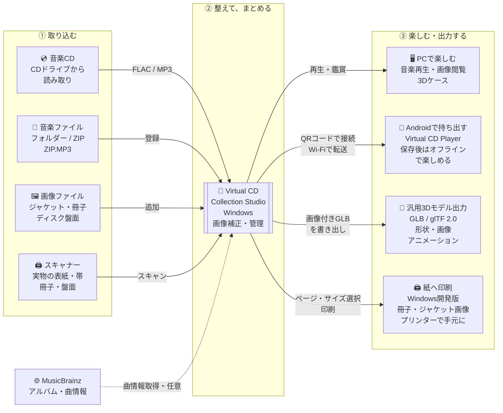

# 連携概要 — CDコレクションを丸ごとデジタル化

Virtual CD Collection Studioは、音源だけでなく、ジャケット・帯・ブックレット・ディスクの絵柄を一つのアルバムにまとめるWindowsアプリです。実物のCDを取り込む場合も、すでにある音楽・画像を使う場合も、同じライブラリで管理できます。Android版Virtual CD Playerへ転送すると、音楽と関連資料を持ち出せます。

公開版はWindows v0.88.0／Android 0.12.0です。旧リリースでは搭載機能が異なります。デジパックの転送とブックレット印刷は対応するWindows開発版が必要です。

## 入力・管理・出力

図をタップ・クリックすると拡大画像を開けます。

編集用の構成図（Mermaid）

実線は音楽・画像の取り込みや利用の流れ、点線は任意のオンライン曲情報取得です。既存音楽の登録は、すべてのファイルを別の場所へコピーするという意味ではありません。

## 実物のCDから始める流れ

1. **音楽を取り込む**：CDドライブで読み取り、FLACまたはMP3へ保存します。取り込み前に各曲を試聴でき、MusicBrainzで曲情報を取得するか、手入力できます。
2. **パッケージを取り込む**：スキャナーから表紙・裏表紙・帯・ブックレット・盤面などを複数枚読み取ります。すでにある画像は、そのまま追加できます。
3. **画像を整える**：自動切り抜き、角度・台形補正、ディスクの円形補正を行います。検出が合わないときは四隅や辺を手動調整し、確認後にアルバムへ保存します。
4. **アルバムとして管理・鑑賞する**：画像の用途を割り当て、音楽・画像・歌詞をまとめて管理します。PCでは音楽再生、ブックレット閲覧、画像から組み立てた3Dケースの鑑賞ができます。
5. **スマートフォンへ持ち出す**：転送対象のアルバムを選び、Androidで接続QRコードを読み取ります。同じLAN経由で音楽・画像・歌詞・対応する3Dデータを保存し、転送後はネット接続なしでも利用できます。
6. **デジタル・紙の両方へ出力する**：画像付きのGLBモデルを汎用3Dビューアーへ書き出せます。対応するWindows開発版ではブックレットビューアーからページ画像をプリンターへ印刷できます。

手持ちの音楽や画像から始める場合は、CD読み取りやスキャンを省略できます。

## 接続と対応範囲

- **CDドライブ**：通常の音楽CDを対象にします。MusicBrainzは曲情報取得用の任意の接続で、音声やローカルの保存パスは送信しません。詳細は [CD取り込み](CD_IMPORT.md)。
- **スキャナー**：TWAINを優先し、WIAも明示的に選択できます。対応ドライバーは必要です。GT-S650では通常の読み取りにEPSONの設定画面を表示せず、独自の画質調整が必要な場合だけ詳細画面を開けます。EPSON単独アプリの画質プリセットの自動継承は保証しません。詳細は [アルバム画像のスキャン](ALBUM_SCANNING.md)。
- **画像と3D**：画像の取り込みと3D上の配置は別の工程です。Front、Back、左右Spine、Discなどの用途を指定してケースへ割り当てます。Android 0.12.0はデジパック2枚組の表示に対応しますが、GLBの生成・転送には対応するWindows開発版が必要です。Windowsの公開版v0.88.0からは出力できません。詳細は [デジパックモデル](DIGIPAK_MODEL.md)、[モバイル3D出力](MOBILE_3D.md)。
- **モバイル転送**：現在のモバイル版はAndroid向けです。Wi-Fi転送は同じ信頼できる家庭内LANで使用し、インターネット越し接続やAndroidからWindowsへの逆方向同期には対応していません。QRコードは接続情報であり、アルバム本体はLAN経由で転送します。SDカード／フォルダーへの出力も利用できます。詳細は [モバイル同期](MOBILE_SYNC.md)。
- **汎用3Dモデル出力**：GLBへ形状・割り当てた画像・開閉などのアニメーションを格納します。音源は含みません。汎用ビューアーでの照明・透明感やアニメーション操作はソフトごとに異なります。これは3Dプリンター用データの作成や印刷ではありません。
- **プリンター出力（Windows開発版）**：ビューアーの現在のページ・全ページ・範囲指定を、用紙に収めるか幅mm指定で印刷します。通常の紙への画像印刷で、両面の面付け・製本・CD盤面への直接印刷は自動化しません。公開版v0.88.0には未搭載です。詳細は [ブックレット印刷](BOOKLET_PRINTING.md)。

## GitHubでの掲載

[README](../README.md)の冒頭にも同じ構成図を掲載しています。READMEでは全体が見えるPNG画像を表示し、タップ・クリックで高解像度画像を開きます。GitHubのREADMEには独自のポップアップ用スクリプトを置かず、通常の画像リンクを使っています。

編集用のMermaidは上の折りたたみ欄に保持しています。変更後はPlaywrightとChromium系ブラウザーがある環境で `node tools/render-integration-diagram.cjs` を実行し、PNGを再生成できます。`PLAYWRIGHT_MODULE` と `DIAGRAM_BROWSER` でライブラリ・ブラウザーのパスを指定できます。図の記法は [GitHub公式の図の作成ガイド](https://docs.github.com/en/get-started/writing-on-github/working-with-advanced-formatting/creating-diagrams) を参照してください。
