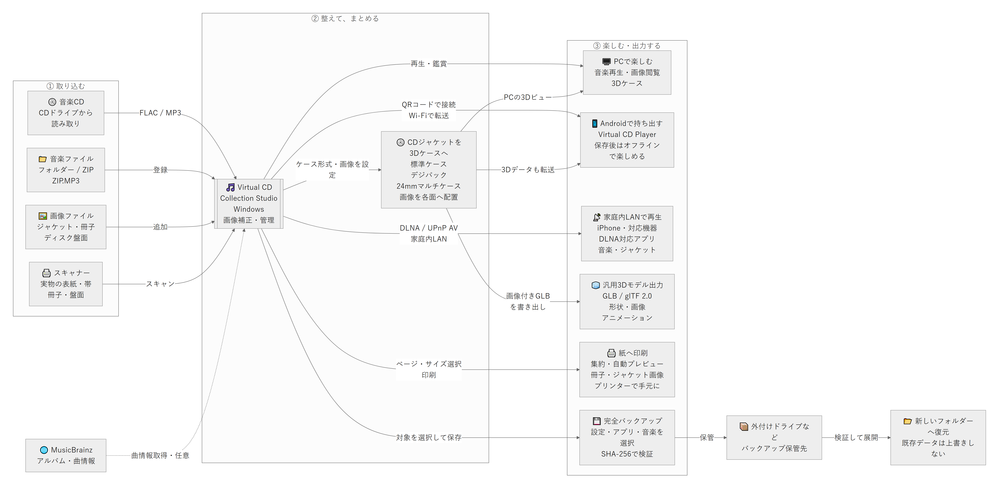
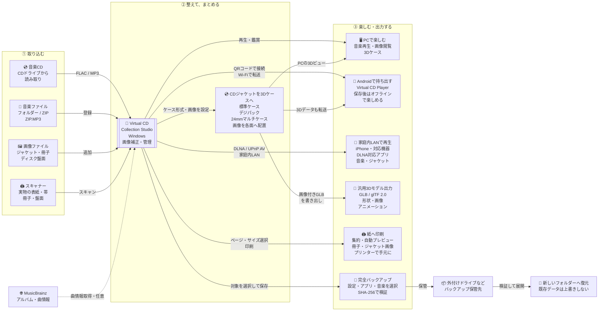

# 連携概要 — CDコレクションを丸ごとデジタル化

Virtual CD Collection Studioは、音源だけでなく、ジャケット・帯・ブックレット・ディスクの絵柄を一つのアルバムにまとめるWindowsアプリです。実物のCDを取り込む場合も、すでにある音楽・画像を使う場合も、同じライブラリで管理できます。Android版Virtual CD Playerへ転送すると、音楽と関連資料を持ち出せます。

公開版はWindows v0.91.0／Android 0.12.2です。CDジャケットを標準ケース・デジパック・24mmマルチケースの各3D形状へ配置し、GLBとして転送・表示できます。デジパックの表紙とブックレットの厚み、ディスクごとの操作も改善しました。従来のブックレット印刷・DLNA配信・AccurateRip照合・完全バックアップも利用できます。DLNAのiPhone・ネットワークプレーヤー実機互換性は未確認です。

## 入力・管理・出力

図をタップ・クリックすると拡大画像を開けます。

編集用の構成図（Mermaid）

実線は音楽・画像の取り込みや利用の流れ、点線は任意のオンライン曲情報取得です。既存音楽の登録は、すべてのファイルを別の場所へコピーするという意味ではありません。

## 実物のCDから始める流れ

1. **音楽を取り込む**：CDドライブで読み取り、FLACまたはMP3へ保存します。取り込み前に各曲を試聴でき、MusicBrainzで曲情報を取得するか、手入力できます。
2. **パッケージを取り込む**：スキャナーから表紙・裏表紙・帯・ブックレット・盤面などを複数枚読み取ります。すでにある画像は、そのまま追加できます。
3. **画像を整える**：自動切り抜き、角度・台形補正、ディスクの円形補正を行います。検出が合わないときは四隅や辺を手動調整し、確認後にアルバムへ保存します。
4. **アルバムとして管理・鑑賞する**：画像の用途を割り当て、音楽・画像・歌詞をまとめて管理します。CDジャケットは標準ケース・デジパック・24mmマルチケースの各3D形状へ配置でき、PCで音楽再生、ブックレット閲覧、3Dケースの鑑賞ができます。
5. **スマートフォンへ持ち出す**：転送対象のアルバムを選び、Androidで接続QRコードを読み取ります。同じLAN経由で音楽・画像・歌詞・対応する3Dデータを保存し、転送後はネット接続なしでも利用できます。
6. **デジタル・紙の両方へ出力する**：画像付きのGLBモデルを汎用3Dビューアーへ書き出せます。ブックレットビューアーから1・2・4・6・9ページ／枚で集約し、設定画面内のプレビューを確認してプリンターへ印刷できます。
7. **家庭内の機器で聴く**：共有するアルバムとLANを選び、DLNA配信を開始します。iPhoneの対応アプリやネットワークプレーヤー側から曲を選んで再生します。PC起動中のストリーミングで、Androidへの保存・オフライン持ち出しとは異なります。

手持ちの音楽や画像から始める場合は、CD読み取りやスキャンを省略できます。

完全バックアップでは、設定・管理データを既定で選択し、アプリ本体と登録済み音楽フォルダーを個別に追加できます。「設定・アプリ・音楽をすべて選択」も可能です。復元は新しいフォルダーに展開し、稼働中の環境を自動上書きしません。詳細は [完全バックアップ](COLLECTION_BACKUP.md) を参照してください。

## 接続と対応範囲

- **CDドライブ**：通常の音楽CDを対象にします。MusicBrainzは曲情報取得用の任意の接続で、音声やローカルの保存パスは送信しません。詳細は [CD取り込み](CD_IMPORT.md)。
- **スキャナー**：TWAINを優先し、WIAも明示的に選択できます。対応ドライバーは必要です。GT-S650では通常の読み取りにEPSONの設定画面を表示せず、独自の画質調整が必要な場合だけ詳細画面を開けます。EPSON単独アプリの画質プリセットの自動継承は保証しません。詳細は [アルバム画像のスキャン](ALBUM_SCANNING.md)。
- **画像と3D**：画像の取り込みと3D上の配置は別の工程です。ケース形式を標準ケース・デジパック・24mmマルチケースから選び、Front、Back、左右Spine、Discなどを適切な面へ割り当てます。Windows v0.91.0とAndroid 0.12.2ではデジパックの外側Front・内側折り目と個別ディスク操作を改善しました。更新後にGLBを再準備・再転送してください。詳細は [24mmマルチケース](MULTI_CASE_MODEL.md)、[デジパックモデル](DIGIPAK_MODEL.md)、[モバイル3D出力](MOBILE_3D.md)。
- **モバイル転送**：現在のモバイル版はAndroid向けです。Wi-Fi転送は同じ信頼できる家庭内LANで使用し、インターネット越し接続やAndroidからWindowsへの逆方向同期には対応していません。QRコードは接続情報であり、アルバム本体はLAN経由で転送します。SDカード／フォルダーへの出力も利用できます。詳細は [モバイル同期](MOBILE_SYNC.md)。
- **汎用3Dモデル出力**：GLBへ形状・割り当てた画像・開閉などのアニメーションを格納します。音源は含みません。汎用ビューアーでの照明・透明感やアニメーション操作はソフトごとに異なります。これは3Dプリンター用データの作成や印刷ではありません。
- **プリンター出力**：ビューアーの現在のページ・全ページ・範囲指定を、1・2・4・6・9ページ／枚で印刷します。設定変更を画面内プレビューへ自動反映し、集約選択時は「現在のページ」から全ページへ切り替えます。通常の紙への画像印刷で、両面の面付け・製本・CD盤面への直接印刷は自動化しません。実プリンターの給紙・発色・寸法は別途確認してください。詳細は [ブックレット印刷](BOOKLET_PRINTING.md)。
- **完全バックアップ**：設定・アプリ本体・音楽フォルダーを選択して外部へ保存し、ファイルごとのSHA-256で検証します。保管先はバックアップ対象の外を指定します。復元は新しいフォルダーへの展開であり、実行中の設定・アプリ・音楽は自動上書きしません。詳細は [完全バックアップ](COLLECTION_BACKUP.md)。

- **DLNA配信**：音楽とジャケットを機器側から選ぶ読み取り専用機能です。配信は初期OFF・同一プライベートIPv4サブネット限定。ZIP内MP3にも対応し、設定で通知領域への常駐を有効にできます。CUE分割・形式変換・3D配信・インターネット越し接続は対象外です。詳細は [DLNA配信](DLNA_SERVER.md)。

## GitHubでの掲載

[README](../README.md)の冒頭にも同じ構成図を掲載しています。READMEでは全体が見えるPNG画像を表示し、タップ・クリックで高解像度画像を開きます。GitHubのREADMEには独自のポップアップ用スクリプトを置かず、通常の画像リンクを使っています。

編集用のMermaidは上の折りたたみ欄に保持しています。変更後はPlaywrightとChromium系ブラウザーがある環境で `node tools/render-integration-diagram.cjs` を実行し、PNGを再生成できます。`PLAYWRIGHT_MODULE` と `DIAGRAM_BROWSER` でライブラリ・ブラウザーのパスを指定できます。図の記法は [GitHub公式の図の作成ガイド](https://docs.github.com/en/get-started/writing-on-github/working-with-advanced-formatting/creating-diagrams) を参照してください。
